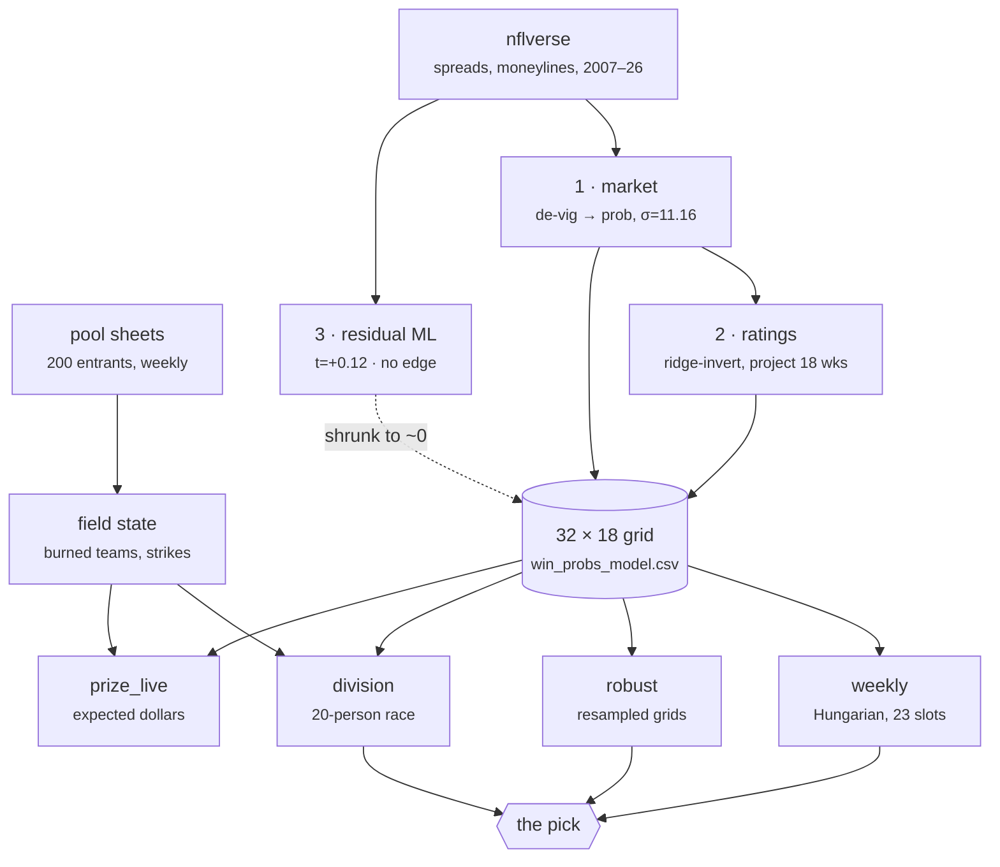

# NFL Survivor Pool Model — 2026

A win-probability model and pick optimiser for a 200-entrant, $5,000 NFL
survivor pool. Probabilities are derived from market prices rather than a
hand-built power rating, and the pick sequence is solved exactly rather than
greedily.

Operational details are in [RUN_GUIDE.md](RUN_GUIDE.md).

## The pool

| | |
|---|---|
| Entrants | 200 |
| Prize pool | $5,000 — $1500/800/600/400/200 overall, plus $150 per division |
| Divisions | 10 of 20, random assignment |
| Picks | **23**, not 18 — weeks 5, 7, 10, 12 and 15 require two teams |
| Strikes | 3 and you're out |
| Reuse | each team once per season |

The 23-pick rule is the whole difficulty. Expected strikes on the
mathematically optimal path is **5.31**, so P(finishing with ≤2) is about
**7%**. Simulating the full field, an average of **1.6 of 200** entrants
finish under the limit — the organiser's stated goal is met by well under
10% of the pool, and the money is usually decided by who lasted longest
rather than who finished.

## Architecture

The dashed edge is the honest part: layer 3 exists, was measured, and
contributes essentially nothing.

**Why market-first.** The closing line aggregates injuries, weather and
sharp money that no public model sees. So the ML layer does not predict game
outcomes — it predicts `actual_margin - spread_line`, which by construction
is only what the line does not already know. If the features carry no signal
the target is noise and the model correctly learns zero.

**It learned zero.** Out-of-sample t-statistic on the shrinkage coefficient:
**+0.12**. No edge over the closing line, which is the expected and honest
result. The value added is calibration and full-season coverage, not beating
Vegas.

**The real edge is projection.** Books only post the current week. Survivor
needs all 23 picks priced now, so team ratings are recovered from posted
spreads by ridge regression and used to project the rest of the season. That
is a forecasting problem, not a handicapping one, and it needs no market
inefficiency to pay off.

**Pick sequencing is an assignment problem.** One team per slot, each used
once, maximise the product of win probabilities — solved exactly by the
Hungarian algorithm. Optimal sequencing beats greedy chalk by **1.58×** on
survival probability with no better information.

## Every parameter is measured

| param | value | how |
|---|---|---|
| σ (spread → probability) | 11.16 | MLE on 2007–2025 |
| σ floor (projection) | 3.717 | fitted on 11 seasons |
| σ growth per week ahead | 0.355 | same |
| ridge penalty | 0.5 | k-fold CV at matched sample size |
| home-field advantage | ~1.4 | fitted per refit |

Two of these started as guesses and the data overruled both. The σ-growth
term was originally 3× too aggressive, which collapsed every distant game
toward a coin flip. And the projection-error model needed an **intercept** —
there is ~3.7 points of error even one week out, so a line through the origin
underestimated the near term and overestimated the far end.

## Validation

`demo.py` generates seasons from a known data-generating process, because on
real data a null result is ambiguous between "the market is efficient" and
"my code is broken":

| scenario | expected | result |
|---|---|---|
| Efficient market | find nothing | t = −1.38 ✓ |
| Backup QB worth 5.5 pts, unpriced | find it | t = +4.42 ✓ |
| Recover ratings from spreads only | recover them | r = 0.9996, MAE 0.17 pts ✓ |

**This harness earned its keep immediately.** The first version judged edges
by R² and failed scenario B — calling a real, planted, money-making
5.5-point effect "no edge", because something appearing in 10% of games
against 13.5 points of noise explains almost no variance. R² is the wrong
statistic for betting-model edges; the detector is now a t-test on the
shrinkage coefficient.

Three check layers run before anything is trusted: `selfcheck.py` (are the
files intact and the parameters consistent?), `smoke_test.py` (does
everything run?), `demo.py` (are the numbers right?).

## What didn't work

**Modelling rival behaviour.** The pool's pick popularity is not a function
of win probability. In Week 1 the field preferred Jacksonville 77–58 over a
bigger favourite; in Week 2 it took Tampa Bay 88–57 over San Francisco at
87%. A softmax on win probability cannot produce that — it is monotone, so
the biggest favourite is always modal. A two-parameter variant with a
"favourite aversion" term fits no better (log-likelihood gain 1.7, and it
still predicts the modal pick backwards).

So contrarian reasoning is unavailable: you cannot fade the popular pick when
you cannot predict what it will be. The expected-dollar figures from
`prize_live.py` are indicative; the ordering of candidates is meaningful.

**Grid uncertainty is expensive.** Scoring each candidate path on the base
grid rather than the perturbed one it was optimised against — which removes
the optimizer's curse, since `E[max] > max[E]` — cuts survival probability
by roughly 6×. `stability.py` puts the commitment horizon at **two weeks**:
beyond that, resampling the grid within its own fitted error reshuffles the
plan entirely.

## Where it stands

Through four weeks: **1 strike**, 41 clean entrants ahead, 107 tied, 45 on
two strikes, 7 eliminated.

Week 2 is the case the model earned: 88 entrants took Tampa Bay at 79% and
lost; the model had San Francisco materially ahead at 87%. That single game
dropped half the pool from one group to the next.

The picks themselves have never been close — every week the recommendation
has come in at 0.0% cost with the point-estimate and robust methods
agreeing. The tooling has mostly been confirming decisions rather than
making them, which is itself worth knowing.
